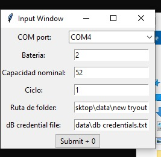
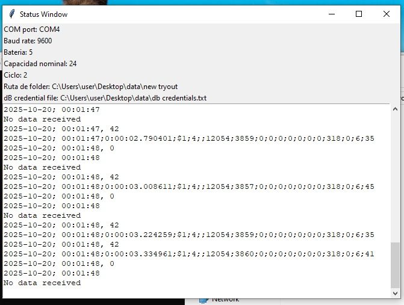

Codes and sample data related to Icharger battery cycles
# Devices and programs
## Devices
Testing devices
1. [iCharger 106B (Junsi) charger/discharger Datasheet](https://www.icharger.pl/manuals/106B_en.pdf) 

2. [iCharger 208 (Junsi) charger/discharger Datasheet](https://www.icharger.pl/manuals/208B_en.pdf)

## Ｓoftware

1. [Data Explorer Download](https://www.nongnu.org/dataexplorer/download.html)
   - [Data Explorer official documentation](https://download-mirror.savannah.gnu.org/releases/dataexplorer/DataExplorer%20-%20Users%20Guide.pdf)

## Raw Data format from Icharger

This data was obtained from reading the serial port and inserting the data directly into a CSV file
`
$1;1;;12000;4190;7;0;0;0;0;0;0;328;0;6;40
`\
Sample data can be viewed from [this file](./test_data/data.csv)
<br>Splitting it by ";" the following data structure was found:

|Index|Value|Description|
| --- | --- | --- |
|0|`$1` |Unknown. It was used to determine the beggining of the data string|
|1|`1`|Baterry stage. This value could take any of the following values: <br>1: Charging <br>2: Discharging <br>4: Resting <br>6: Finished
|2| | Empty|
|3|`12000`|Supplied voltage|
|4|`4190`|Applied voltage to the battery (mV). For the tests in this repository it varied from 3.0 to 4.2V
|5|`7`|Applied current to the battery (cA). For the tests in this repository it varied from 0 to 50 mA
|6 - 11|`0;0;0;0;0;0`|Corresponds to the Cell Voltage. This devices is able to manage up to 8 batteries|
|12|`328`|Unknown|
|13|`0`|Unknown|
|14|`6`|Battery capacity in (mAh). For the tests in this repository, this values rests itself in every battery stage.
|15|`40`|Unknown|

Pending parameters to discover/establish relationship. 
- Temperature
Similar repositories have been found, yet to be tested:
- [icharger_serial_decoder repository](https://github.com/alistairmackenzie/icharger_serial_decoder/): This has the most similar data structure to the one empirically discovered in this trial
- [icharger-X8-log-parser](https://github.com/digimer/iCharger-X8-Log-Parser) This is also a serial log parser, yet the data structure is much larger than the one obtained for this repository and testing.

# Requirements to run this programas
- Python 3. [Link to download](https://www.python.org/downloads/)
- PostgreDB [Link to download](https://www.postgresql.org/download/windows/)
- **For testing purposes** com0com [Link to download](https://sourceforge.net/projects/com0com/)

## Programs and functionalities

|Recommended order to run program|Program|Description|
|---|---|---|
|0|[requirements_installation.py](./requirements_installation.py)|Installs the python libraries needed to run the following programs<br>**Only need to run once**|
|1|[csv_to_DP.py](./csv_to_DP.py)|Creates postgreDB tables, reads data from CSV files into the database|
|2 <br>(no graphical user interface GUI)|[monitor DataExplorer.py](./monitor%20DataExplorer.py)|Reads the data from the Serial COM port and saves it into csv files. If DB credentials provided, it can also saves the data into the database <br>**This program has no graphical interface**|
|2 <br> (with graphical user interface GUI)|[monitor GUI.py](./monitor%20GUI.py)|Same functionalities as monitor DataExplorer, but added graphical user interface (GUI)|
|For testing purposes|[txt2COM.py](./txt2COM.py)|This programs helps to read the data from a txt or csv file and feeds it through a COM port to test the functionality of the monitor DataExplorer and/or monitor GUI

### Summary Explanation for the provided programs

#### [Requirements_installation.py](./requirements_installation.py)
This programs checks if the needed libraries ares installed in the system, if not, they're installed using PIP command.

Needed libraries and their use
|Library|Use case|
|---|---|
|Serial|Used for serial communication and listing serial ports|
|psycopg2-binary|Using for stablishing communication with the postgreDB|
|pandas|Used for large data processing|
|matplotlib|Used for generating graphics|
|tkinter|Used for generating the graphical user interface (GUI)|

#### [csv_to_DP.py](./csv_to_DP.py)
This program is used to generate the tables in the database to store the data. Also it reads the data from any CSV file and inserts it into the database when needed.

Generated tables
- charging
- dicharging
- rest
- all_data

Every table will have the following columns
- date
- time (this is a stopwatch like, used to measure the duration of the charging stage)
- voltage (measured in V)
- current (measured in A)
- capacity (measured in mAh)
- cycle number
- nominal_capacity
- mode (only on all_data table)

#### [monitor DataExplorer.py](./monitor%20DataExplorer.py)
**This program has no user graphical interface (GUI)**

Reads the data directly from the com port and saves it into a CSV file in the local computer for the desired folder path and local postgreDB (if credential are provided).

#### [monitor GUI.py](./monitor%20GUI.py)
Reads the data directly from the com port and saves it into a CSV file in the local computer for the desired folder path and local postgreDB (if credential are provided).
This program generates two(2) screen

**First screen: Input screen**
The user inputs the following information 
1. Selects the COM port from which to read the data from the icharger
2. Battery number
3. Battery nominal capacity
4. Battery starting cycle number
5. Path to folder to which save the data
6. (optional)txt file with the postgreDB credentials




**Second Screen: Status screen**

Show a terminal like screen that prints the read information from the COM port

# Extracting data from postgreDB to a file format
## if using docker container

```
docker exec -t <container_name> pg_dump -U <user> <databasen_name> > <file_name>.sql #This creates a SQL file from the data in the database

docker cp <container_name>:/<file_name>.sql ./<new_file_name>.sql #This copies the data **outside** the container
```
