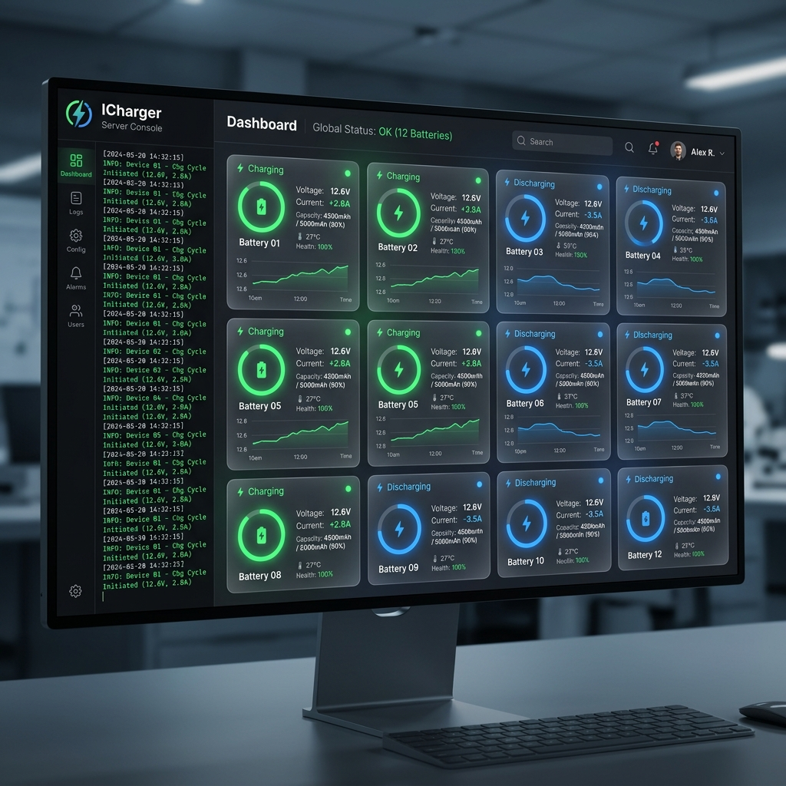
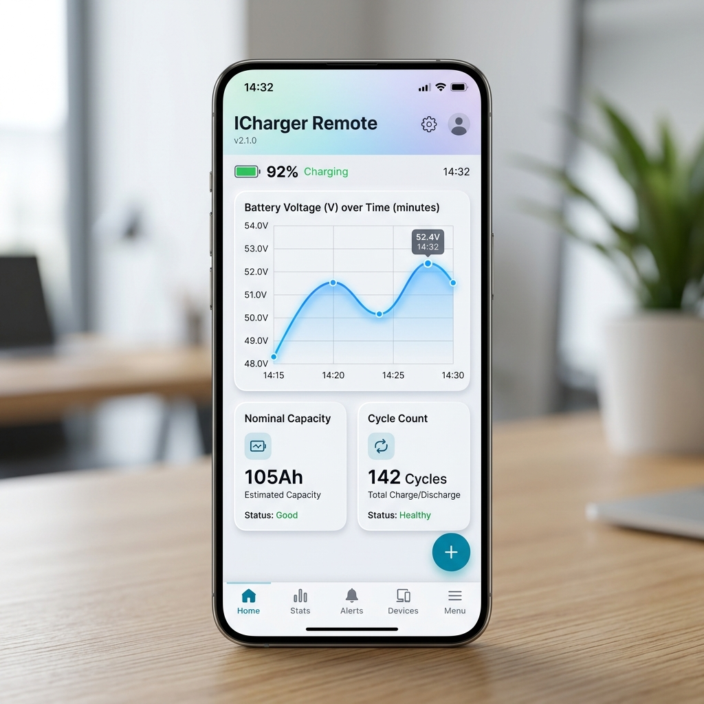

# ICharger Multi-Battery Ecosystem

A distributed, real-time battery monitoring system migrated from legacy Python/Tkinter to a high-performance Flutter architecture. This ecosystem enables concurrent hardware monitoring from a desktop server and remote visualization from mobile or web clients.

## 🚀 Modern Flutter Infrastructure

The new architecture splits the workload into two specialized applications communicating over a local WebSocket network.

### 1. ICharger Server (Desktop Console)
The core bridge between physical hardware and the network.
- **Hardware Interface:** Native Serial communication with "Busy" port detection.
- **Auto-Logging:** Generates structured CSV logs and automatically splits data by state (Charge, Discharge, Rest).
- **Network Broadcast:** Built-in WebSocket server (Port 8080) for real-time telemetry.



### 2. ICharger Client (Remote Monitor)
A cross-platform app for mobile, tablet, and web visibility.
- **Rich Visualization:** Live line charts for Voltage, Current, and Capacity with dynamic scaling.
- **Remote Terminal:** Synchronized view of the raw serial stream from the server.
- **Connection:** Effortlessly connects to any server IP on the local network.



---

## 🐍 Legacy Python Suite
The original Python toolset provided the foundation for the data processing logic and local automation.

### Core Scripts & Functionalities
| Program/File                                               | Description                                                                                                                                                        |
| :--------------------------------------------------------- | :----------------------------------------------------------------------------------------------------------------------------------------------------------------- |
| [**`multiple_tabs.py`**](./multiple_tabs.py)               | **Primary Desktop Monitor:** Advanced Tkinter GUI for managing multiple chargers via a tabbed interface. Includes real-time terminal logging and data persistence. |
| [**`monitor_DataExplorer.py`**](./monitor_DataExplorer.py) | **Headless Logger:** Reads serial data and saves directly to local CSVs or a PostgreSQL database. Designed for stable, terminal-based background logging.          |
| [**`monitor_api.py`**](./monitor_api.py)                   | **FastAPI Bridge:** Provides a RESTful interface for external applications to query real-time battery stats and manage logging threads.                            |
| [**`csv_to_DP.py`**](./csv_to_DP.py)                       | **Database Ingestion:** Processes generated CSV files into a structured PostgreSQL schema (charging, discharging, rest, all_data tables).                          |
| [**`txt2COM.py`**](./txt2COM.py)                           | **Testing Utility:** Feeds CSV/TXT data through a virtual COM port to simulate hardware for software testing without a physical charger.                           |

### Configuration & Setup
- [**`requirements_installation.py`**](./requirements_installation.py): Automated dependency installer for Python libraries (colorama, pyserial, pandas, etc.).
- [**`requirements.txt`**](./requirements.txt): List of necessary Python packages.
- [**`postgreDB_credential.txt`**](./postgreDB_credential.txt): Configuration file for database connection parameters.

---

## 🔬 Hardware & Data Structure
### Supported Devices
- [**iCharger 106B+**](https://www.icharger.pl/manuals/106B_en.pdf) & [**iCharger 208B**](https://www.icharger.pl/manuals/208B_en.pdf) (Junsi).

### Raw Data Protocol
Data is streamed via Serial at **9600 Baud** (or customized). Example frame:
`$1;1;;12000;4190;7;0;0;0;0;0;0;328;0;6;40`

| Index    | Value   | Description                                                           |
| :------- | :------ | :-------------------------------------------------------------------- |
| **0**    | `$1`    | Start-of-frame identifier.                                            |
| **1**    | `1`     | **Battery Stage:** 1: Charging, 2: Discharging, 4: Rest, 6: Finished. |
| **3**    | `12000` | Supplied voltage.                                                     |
| **4**    | `4190`  | Applied voltage to battery (mV).                                      |
| **5**    | `7`     | Applied current to battery (cA).                                      |
| **6-11** | `0;...` | Cell Voltages (Supports up to 8 cells).                               |
| **14**   | `6`     | Battery Capacity (mAh). Resets per stage.                             |

---

## 🛠 Prerequisites

### Hardware Requirements
- Python 3.x
- [PostgreSQL](https://www.postgresql.org/download/) (for database logging)
- [com0com](https://sourceforge.net/projects/com0com/) (for virtual COM port testing)

### Native Build Tools (Linux)
To compile the high-performance Flutter desktop apps, ensure the following are installed:
```bash
sudo apt update
sudo apt install libserialport-dev lld-18
```

## 📊 Processing Workflow
The system follows a reactive cycle:
1. **Acquisition:** Data read from COM port via `multiple_tabs.py` or `icharger_server`.
2. **Parsing:** Logic filters raw strings, detects state transitions, and calculates durations.
3. **Storage:** Raw CSVs created per session; specific state-based CSVs generated for analytics.
4. **Verification:** Integrated final check ensures row-count parity between raw and processed files.
